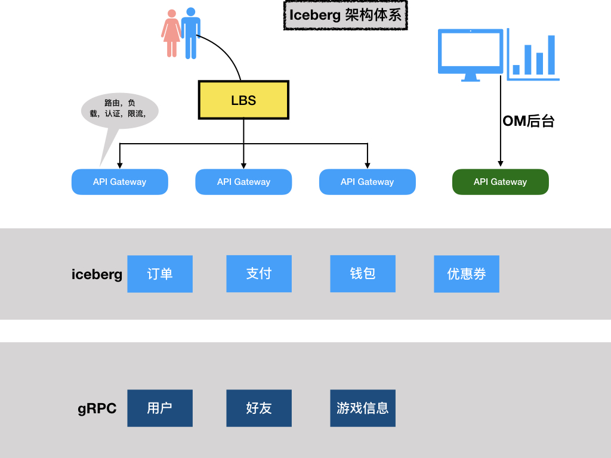
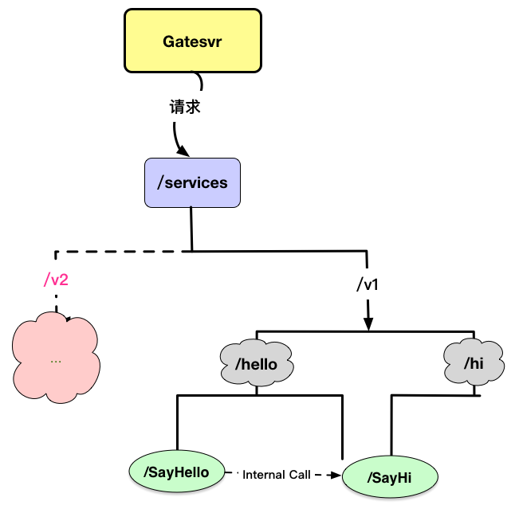

# Iceberg
服务层的统称。iceberg意为冰山，意味着服务层向外部提供简练的接口,来支持各种业务。这些简练的接口就像海面上的冰山一角一样，而隐藏在水面下的则是iceberg体系中众多的服务和数据。

## 版本
- v1.0


## 关键词
- 高并发
- 分布式
- 多实例负载均衡
- http，tcp，protobuf
- 水平扩展
- 服务发现(etcd)
- 代码自动生成(protoc-gen-go)

## 源起
在分布式系统中，功能点往往会切分成多个细小的高内聚的独立服务。服务之间通过RPC的方式合作来完成系统的功能。这样一来，各种类型的服务会越来越多，而且每种类型的服务往往都以集群的方式布署，整个系统中的服务实例的数量就更多。这么一来在增加服务横向收缩或者是增减新的服务类型的时候将会对开发和运维带来巨大的工作量。

解决办法是系统提供服务发现机制。统一的整理整个系统的拓扑结构。通过服务的注册和发现机制来降低服务之间的耦合。
并且通过抽离服务的共性，使用API Gateway作为服务的入口。在Gateway层做路由分发，负载控制，限流，熔断等。

## 实现方法
经过调研，决定采用etcd来做为服务发现基础服务。相较于zookeeper, etcd有以下几个优点：

- 1. 采用go语言开发，官方提供golang sdk。易于开发
- 2. 运维和布署更简单
- 3. clientv3使用了gRPC与etcd通信，更加高效

Iceberg采用RESTful风格的接口,正好可以天衣无缝的和etcd的树型存储结构配合。各个服务连接到etcd后，通过订阅者模式来感知系统拓扑的变化。

## 服务架构图


## 路由规则



Iceberg服务体系是一个树形结构，它反映的是RESTful风格的接口组织关系。**除了provider节点外，树中所有的节点都表示一个RESTful接口。**

## 服务注册节点说明
```text
每个服务会在Etcd中注册本服务信息，主要包括配置，服务名称，实例节点地址，实例节点方法
如下为一个订单服务在etcd中注册的服务信息：

/services/v1/order/provider/instances/10.25.0.22:5768
10.25.0.22:5768
/services/v1/order/provider/name
Order
/services/v1/order/create/provider/allowed/false
create
/services/v1/order/refund/provider/allowed/false
refund
/services/v1/order/state/provider/allowed/false
state

instances:  表示服务实例节点地址信息
name:		为服务名称
allowed:	方法名称和服务授权

gateway在转发请求时，会按接口树层级进行过滤。也就是说，gateway会首先找到相应的服务，将数据传输给此服务，再由此服务去找到相应的方法，执行逻辑代码后返回信息给gateway，gateway再返回给请求方。在接口匹配时，目前为完全匹配。 

服务粒度的拆分是考虑可以出现这样的情况，随着业务的发展，一个接口节点可能会细分出很多个子节点，这些子节点的所代表的功能大小不一。这种情况下，我们可以用一个新的服务来处理某一个或者某些节点的接口，剩下的节点继续由老的服务来处理。
```

* 服务路径是由proto-gen-go按照如下规则自动生成

- [根]/[版本号]/[服务名称]/[服务方法]

- 例如
- 服务标识：     /services/v1/hello
- 服务请求路径： /services/v1/hello/sayhello        

## 协议
[Iceberg协议文档.md](doc/Iceberg协议说明.md)

## 开发效率

* iceberg 集成了grpc,zipkin 自动生成代码功能,监控服务。只需定义protobuf语法风格的描述文件，即可生成客户端和服务端代码。提升开发效率和精简代码。

## 快速开始

Download and install,go version 1.9+ is required

- start etcd server([etcd下载地址](https://github.com/coreos/etcd/releases/))
- cd github.com/kwins/iceberg/demo
- make
- ./build/gateway
- ./build/s1
- ./build/s2

```cmd
请使用自己内网IP

curl -H "Content-Type:application/json" -d '{"name":"kwins"}' 'http://192.168.0.156:3201/services/v1/hello/sayhello'

```

- remove demo

```cmd
make clean
```

## 服务详细安装步骤
* 1，安装google protoc编译器,下载ETCD
    - [protoc下载地址](https://github.com/google/protobuf/releases/tag/v3.5.0)
    - [protoc安装教程](http://www.jianshu.com/p/0a70eef1bd4a)
    - [etcd下载地址](https://github.com/coreos/etcd/releases/)

* 2，下载相关依赖包

```get
go get github.com/coreos/etcd/clientv3
go get github.com/nobugtodebug/go-objectid
go get github.com/golang/protobuf/proto
```

* 3，编译 proto-gen-go
- 对google proto-gen-go进行修改，增加了irpc插件，生成iceberg需要的代码。

```cmd
    cd iceberg/protoc-gen-go
    go build
    mv protoc-gen-go $GOBIN
```

* 4，编写hello.proto文件,生成客户端服务端代码。

```proto
syntax = "proto3"; // 指定proto版本
package hello;     // 指定包名

// 定义Hello服务
service Hello {
	// SayHello 定义SayHello方法
	rpc SayHello(HelloRequest) returns (HelloResponse) {}
}

// HelloRequest 请求结构
message HelloRequest {
	string name = 4;
}

// HelloResponse 响应结构
message HelloResponse {
    string message = 1;
}
```

* 5，运行👇命令生成客户端和服务端代码

```
protoc --go_out=plugins=irpc:. *.proto
```

* 6，实现服务端代码(*具体代码，见demo目录*)

```golang
// Hello 对象
type Hello struct {
}

// SayHello handel message 01
func (id *Hello) SayHello(c frame.Context) error {
	var res hello.HelloResponse
	res.Message = "welcome~~~"
	log.Info("SayHello receiver....", c.Bizid(), c.Header().Get("A"))
	return c.JSON(&res)
}


var (
	cfgFile  = flag.String("config-path", "icetest_conf.json", "config file")
	logLevel = flag.String("level", "debug", "log level")
	logPath  = flag.String("logPath", "", "log path")
)

func main() {
	// 解析命令行参数
	flag.Parse()

	// 设置进程的当前目录为程序所在的路径
	dir, _ := filepath.Abs(filepath.Dir(os.Args[0]))
	os.Chdir(dir)
	var baseCfg config.BaseCfg

	var etcdCfg config.EtcdCfg
	etcdCfg.EndPoints = []string{"http://127.0.0.1:2379"}
	etcdCfg.User = "iceberg"
	etcdCfg.Psw = "123456"
	etcdCfg.Timeout = 3

	baseCfg.Etcd = etcdCfg
	// 直接注册就行了
	pb.RegisterHelloServer(new(Hello), &baseCfg)
}
```

* 7，编译并运行gateway，hello，etcd

* 8，
```cmd
curl -H "Content-Type:application/json" -d '{"name":"wlaier"}' 'http://${内网IP}:3201/service/v1/hello/sayhello'
```

## TODO：
- 完善失败重试机制

## QA
QQ群：637253339